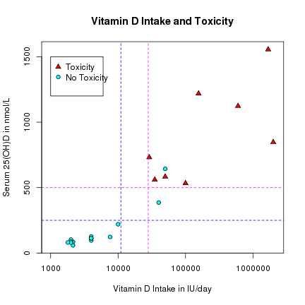

# 1 Executive Summary

## 1.1 Introduction

We want to graphically summarize the findings from Hathcock et al, 2007 re vit D toxicity. This is modified version of a plot contained in the GrassrootsHealth chart book.

## 1.2 Data and Methods

We transcribed the contents of Tables 1 and 2 of Hathcock et al into the file hathcock.csv. The file lists 

* papers reviewed
* mean dosage in international units (IU)
* mean observed serum level
* whether any toxicity was observed (yes/no)
* whether the study was included in the summary (Hathcock et al reviewed a few papers which they eventually decided to exclude; details below)

For the studies reviewed, we plot dosage in IU on the x-axis (log10 scale), serum level in nmol/L on the y-axis, and indicate whether the combination was associated with an adverse event or not. 

## 1.3 Results

We produced and saved the figure "hathcock.png" for later use.

## 1.4 Conclusions

There is a healthy "clear margin" on both axes between values deemed to be below the No Observed Adverse Event Level (NOAEL, 10K IU/day, 250 nmol/L) and the Lowest Observed Adverse Event Level (LOAEL, 29K IU/day, 500 nmol/L). 

We note in passing that the study with toxicity at 29K IU/day (Jacobus et al, 1992), there were 8 individuals examined who received dosages ranging from 725 to 4364 ug (29000 to 174560 IU) where the mean reported serum level was 731 nmol/L. The point on the plot for Jacobus et al shows just the lowest dosage level; we have not reviewed the Jacobus et al paper directly to determine whether toxicity was seen in all cases.

# 2 Data Parsing and Loading

Table 1 of Hathcock et al lists several clinical trials which have not given rise to adverse events, whereas Table 2 lists adverse events that have been reported (mostly case studies).

The table "hathcock.csv" contains our transcription of the results in Tables 1 and 2 of Hathcock et al.: 21 entries from the first, and 9 from the second. We don't use data from all of these. In particular, we omit results from 7 entries in Table 1 and 1 entry from Table 2. For 6 of the omissions from Table 1, the reason is that no serum level information was supplied, so we don't know where
to plot the results. One of these 6 is the study of Narang et al, 1984, for which an adverse event was reported but Hathcock et al think the finding was aberrant for various reasons. The 7th is due to a case of apparent duplication - both Berlin et al 1986 and Berlin et al 1987 appear to refer to the same cohort of 12 patients (same dose and serum levels), so we omit the latter to avoid overplotting. The one entry omitted from Table 2 is the case study of Jansen et al 1997 describing a single woman with what may have been hypercalcemia at an extremely low dose. This has not been replicated, and Hathcock et al discount it. 

For several studies, ranges of doses and serum levels are reported - we have generally chosen the lowest value reported for plotting.


```r
library(VitDpackage)
#getwd()
system.file('extdata','hathcock.csv',package='VitDpackage')
```

```
## [1] "/home/ywang31/R/x86_64-unknown-linux-gnu-library/3.2/VitDpackage/extdata/hathcock.csv"
```

```r
hathcock <- read.csv(system.file('extdata','hathcock.csv',package='VitDpackage'), 
                     header=TRUE, stringsAsFactors = FALSE)
```

# 3 Plot Data

Here, we want to plot dosage in IU on the x-axis (on a log10 axis), serum level in nmol/L on the y-axis, and indicate whether the combination was associated with an adverse event or not. 

First, we specify some plotting parameters (symbols to use and the like).


```r
isUsed <- hathcock[,"Used"] == "yes"
plotCol <- rep("cyan", nrow(hathcock))
plotCol[hathcock[,"AdverseEvent"]=="yes"] <- "red"
plotSym <- rep(21, nrow(hathcock))
plotSym[hathcock[,"AdverseEvent"]=="yes"] <- 24
```

Then we produce the actual plot.


```r
plot(hathcock[isUsed,"DoseInIU"],
     hathcock[isUsed,"SerumLevelInNmolPerL"],
     log="x",
     xlab="Vitamin D Intake in IU/day",
     ylab="Serum 25(OH)D in nmol/L",
     main="Vitamin D Intake and Toxicity",
     pch=plotSym[isUsed],
     bg=plotCol[isUsed],
     xaxt="n",
     xlim=c(1000, 2100000))

abline(h=500, lty="dashed", col="magenta")
abline(v=28000, lty="dashed", col="magenta")
abline(h=250, lty="dashed", col="blue")
abline(v=11000, lty="dashed", col="blue")
axis(side=1, at=c(1000,10000,100000,1000000),
     labels=c("1000", "10000", "100000", "1000000"))

legend(x=c(1000,6000), y=c(1500,1200), legend=c("Toxicity","No Toxicity"),
       pch=c(24,21), pt.bg=c("red","cyan"))
```

 
